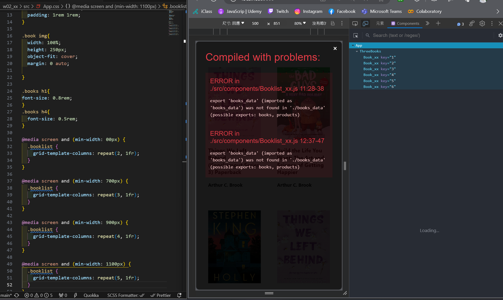

[my github repo URL](https://github.com/yangcici1010/112N)

### w02-p1: modify css to make books responsive

### w02-p2: share github repo to the teacher

### W02-P3: Use <Booklist_xx> to show all books in books_data.js array

#雖有 BUG 但主要內容已完成

### W02-P4: Use useState hook to store all books in books_data.js array

### W2 git logs

$ git log --pretty=format:"%h%x09%an%x09%ad%x09%s" --after="2023-09-19"
d12b701 PeiCIh Yang Sat Sep 23 22:30:49 2023 +0800 w2
