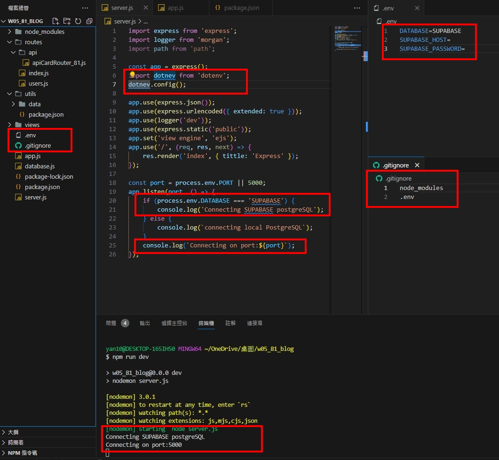
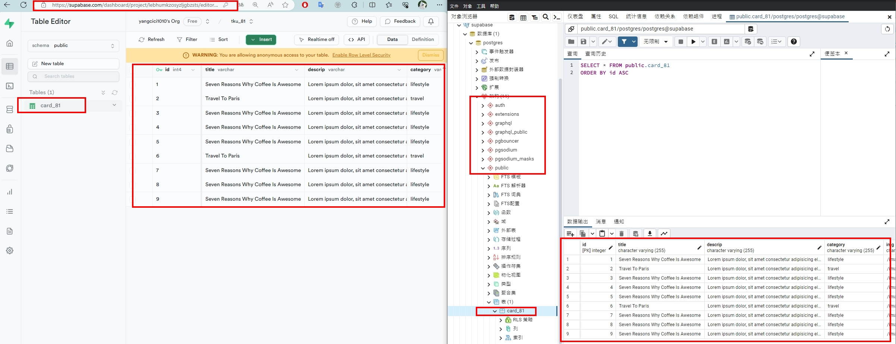
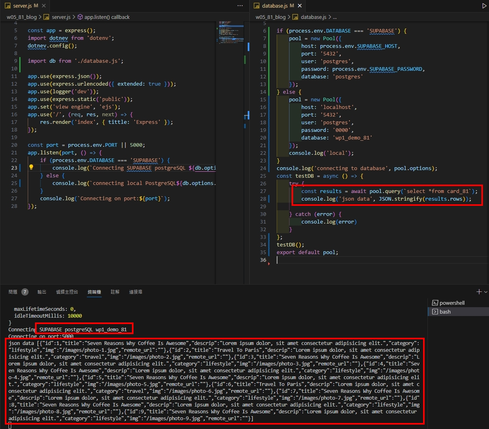
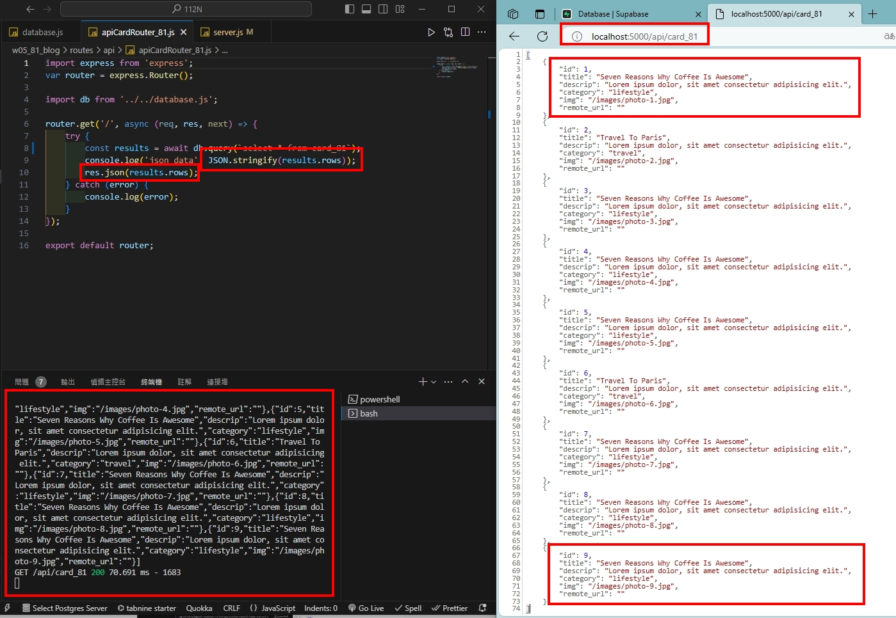

#209410181 楊佩慈
#GIT REPO URL:   https://github.com/yangcici1010/112N.git

###W05-P1: Demo how to use environment variable DATABASE

`commit 56110ff8f241b08b3c107b4f05e932ff18580854
Author: PeiCIh Yang <209410181@o365.tku.edu.tw>
Date:   Sat Oct 14 02:56:31 2023 +0800`

###W05-P2: Using pgAdmin 4 to get table card_81 from Supabase

`commit 8b18d15858f92817731d12b50795ca8ab1983572
Author: PeiCIh Yang <209410181@o365.tku.edu.tw>
Date:   Sat Oct 14 04:47:18 2023 +0800`

###W05-P3: Using pgAdmin

`commit f0bce22430eb8368d934b0d5e4ff35652a18e3b5 (HEAD -> main, origin/main, origin/HEAD)
Author: PeiCIh Yang <209410181@o365.tku.edu.tw>
Date:   Sat Oct 14 05:10:11 2023 +0800`

###W05-P4: For route /api/card_81, get Json data from Supabase

`commit f0bce22430eb8368d934b0d5e4ff35652a18e3b5 (HEAD -> main, origin/main, origin/HEAD)
Author: PeiCIh Yang <209410181@o365.tku.edu.tw>
Date:   Sat Oct 14 05:10:11 2023 +0800`