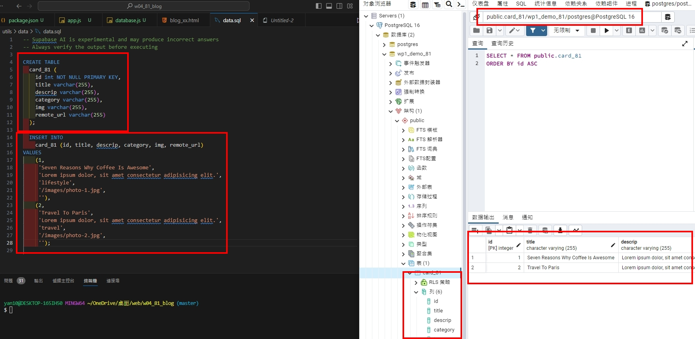

### W04-P1: Connect database wp1_demo_81

`1764f11 PeiCIh Yang     Sat Oct 7 22:22:12 2023 +0800   W04-P1: Connect database wp1_demo_81`

### W04-P2: Using SQL to create table card_xx, and insert two data

`a2a4075 PeiCIh Yang     Sat Oct 7 23:10:30 2023 +0800   W04-P3: Using Supabase SQL editor to create table card_xx, and insert two data`

### W04-P3: Using Supabase SQL editor to create table card_xx, and insert two data

`a2a4075 PeiCIh Yang     Sat Oct 7 23:10:30 2023 +0800   W04-P3: Using Supabase SQL editor to create table card_xx, and insert two data`

### W04-P4: Use JavaScript code to get card_81 data from local wp1_demo_81 database

`0aac14a PeiCIh Yang     Sat Oct 7 23:11:21 2023 +0800   W04-P4: Use JavaScript code to get card_xx data from local wp1_demo_81 database`

### W04-P5: Show 9 data in both local PostgreSQL and Supabase

`1b5c6c2 PeiCIh Yang     Sat Oct 7 23:19:15 2023 +0800   W04-P5: Show 9 data in both local PostgreSQL and Supabase`

### W04-P6: W4 all logs

`$ git log --pretty=format:"%h%x09%an%x09%ad%x09%s" --after="2023-10-03"`
`1b5c6c2 PeiCIh Yang     Sat Oct 7 23:19:15 2023 +0800   W04-P5: Show 9 data in both local PostgreSQL and Supabase`
`0aac14a PeiCIh Yang     Sat Oct 7 23:11:21 2023 +0800   W04-P4: Use JavaScript code to get card_xx data from local wp1_demo_81 database`
`a2a4075 PeiCIh Yang     Sat Oct 7 23:10:30 2023 +0800   W04-P3: Using Supabase SQL editor to create table card_xx, and insert two data`
`1764f11 PeiCIh Yang     Sat Oct 7 22:22:12 2023 +0800   W04-P1: Connect database wp1_demo_81`
`7696464 PeiCIh Yang     Sat Oct 7 22:26:01 2023 +0800   fix dir`