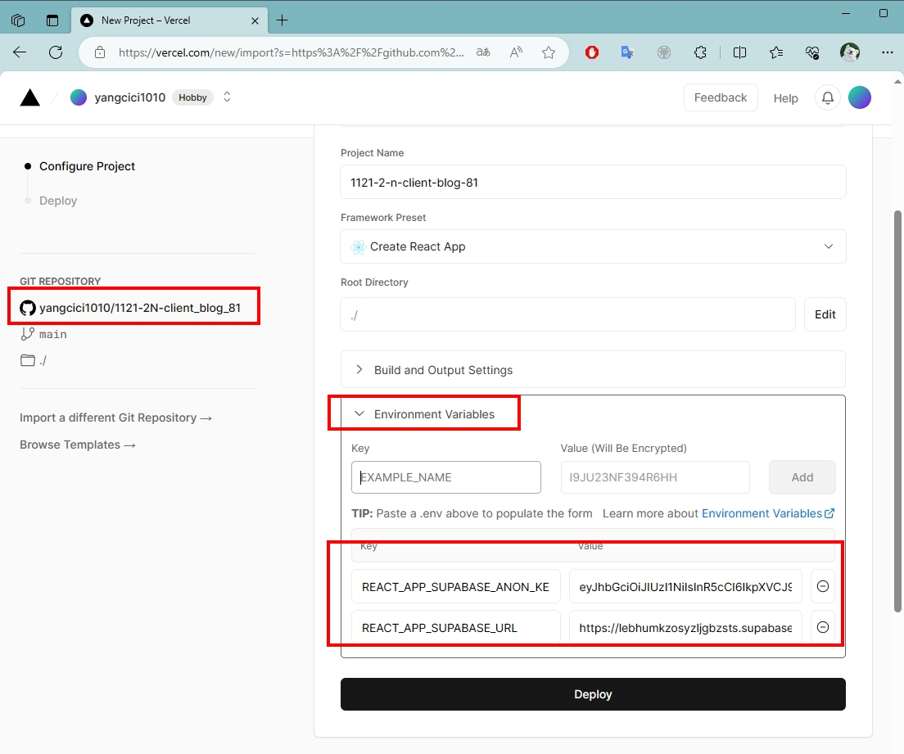

### W07-P1: jwt introduction using anon key in Supabase

### W07-P2: Fetch blog data from Supabase

### W07-P3: Deploy to vercel, using /supa_xx to get blogs from Supabase

`commit e2a9a3ef6e6b02f7f2e63e5b9cbb017b82af7471
Author: PeiCIh Yang <209410181@o365.tku.edu.tw>
Date:   Thu Oct 26 21:12:02 2023 +0800

    first commit`

### W07-P4: Implement BlogLocalJson_xx.js to fetch blogs from json data

